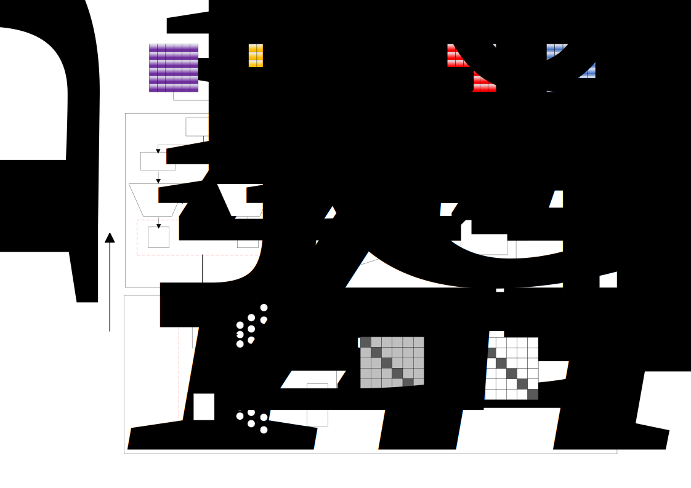

# A redundancy reduction contrastive learning based cancer subtype clustering method using multi-omics data (CLCluster)

Here, we propose a redundancy-reduction contrastive learning-based method (CLCluster) based on copy number variation, methylation, gene expression, miRNA expression, and alternative splicing for cancer subtype clustering of 33 cancer types.
CLCluster (shown in Figure 1) is a redundancy-reduction contrastive learning clustering method based on multi-omics datasets for cancer subtyping. The method performs feature extraction by redundancy-reduction contrast learning model. For the extracted features, after introducing survival information for further dimensionality reduction, clustering is performed using Mean-Shift to obtain cancer subtypes. To prevent model collapse and not require negative examples or asymmetric structures, we employ a unique loss function for Redundancy-reduction contrastive learning.



## Dependencies

The model is developed with Python 3.10, Pytorch 2.2.1, and CUDA12.1, for other environments, please refer to `environment.yml`


## Start

The version of the databases
| Tools | source | Identifier |
| ---- | ---- | ---- |
| TCGA | v35.0 | https://gdc.cancer.gov/ |
| TCGASpliceSeq | 2.1 | https://bioinformatics.mdanderson.org/TCGASpliceSeq/index.jsp |
| GENCODE | V45 | https://www.gencodegenes.org/human/release_45.html |

    ```bash
    python main.py
    ```
This will run CLCluster with the test dataset in `test/`. If you need to use a local dataset to use CLCluster for clustering, please refer to the dataset format in `test/` to provide the data.

Results include raw data downscaling results `CESC_features.csv`, cancer subtype clustering results `CESC_cluster.csv`, subtype KM images `CESC_KM.png`, subtype TSEN visualization images `CESC_TSEN.png`. The results will be in `out/`.We provide the preprocessed data and model clustering results of all other cancers in the data folder.

